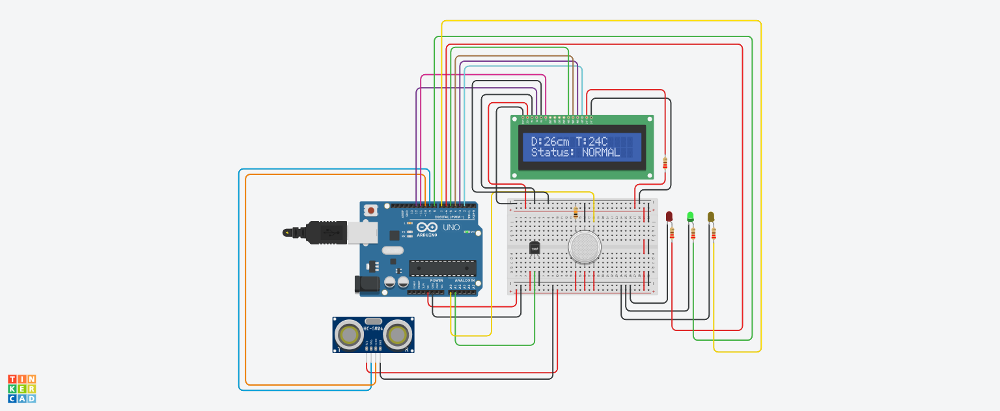

# 🎓 Smart Exam Hall Guard: Anti-Cheating & Safety Monitor 🛡️


**Smart Exam Hall Guard** is a unique, automated invigilation system designed to maintain academic integrity and environmental safety during examinations. By using behavioral analysis and ambient sensing, it detects suspicious activities like leaning for cheating or the presence of hidden electronic devices.

---

## 💡 Why This Project?
Traditional exam monitoring relies heavily on human invigilators. This system introduces a **"Smart Invigilation Assistant"** that uses sensors to track student posture and hall environment, making it a modern solution for educational institutions.

## 🚀 Core Features

- **🔍 Posture Analysis (Anti-Cheating):** Monitors the student's distance from the desk. If they lean too close (<15cm) or pull back too far (>30cm), it triggers a **"WRONG POSTURE!"** alert.
- **🌡️ Stress & Device Detection:** Tracks abnormal temperature spikes that may indicate high physiological stress or the heat generated by hidden **smartphones/gadgets**.
- **🚭 Environmental Guard:** Detects smoke, gas leaks, or chemical disturbances in the hall to ensure a safe testing environment.
- **📟 Live Monitoring Dashboard:** A 16x2 LCD provides real-time data on distance (D) and temperature (T), ensuring total transparency.
- **🚨 Color-Coded Alerts:**
  - **🟢 GREEN:** System Normal (Safe range 15-30cm).
  - **🔴 RED:** Posture Violation or Smoke Detected.
  - **🟡 YELLOW:** High Heat or Electronic Device Alert.

---

## 🧠 The "Smart" Logic
The system uses a **Fixed Posture Monitoring** algorithm:
1. **Normal Range (15cm - 30cm):** The student is sitting upright and focused.
2. **Cheating Attempt (<15cm):** Leaning forward excessively to hide or copy materials.
3. **Suspicious Movement (>30cm):** Leaning back or moving away to communicate with others.

---

## 🛠️ Hardware Stack

| Component | Purpose |
| :--- | :--- |
| **Arduino Uno** | Microcontroller (Central Processing) |
| **HC-SR04 Ultrasonic** | Human Posture & Proximity Sensor |
| **TMP36 Sensor** | Stress and Electronic Device Heat Monitor |
| **MQ Gas Sensor** | Smoke & Environmental Hazard Detection |
| **16x2 LCD Display** | Live Status Dashboard |
| **LED Indicators** | Visual Alerting System (R, Y, G) |

---

## 📸 Circuit Design & Simulation

Here is the full circuit architecture designed in **Tinkercad**:



---

## 💻 Installation & Usage

1. **Clone the Repository:**
   ```bash
   git clone https://github.com/Masum8823/Smart-Exam-Hall-Guard.git
