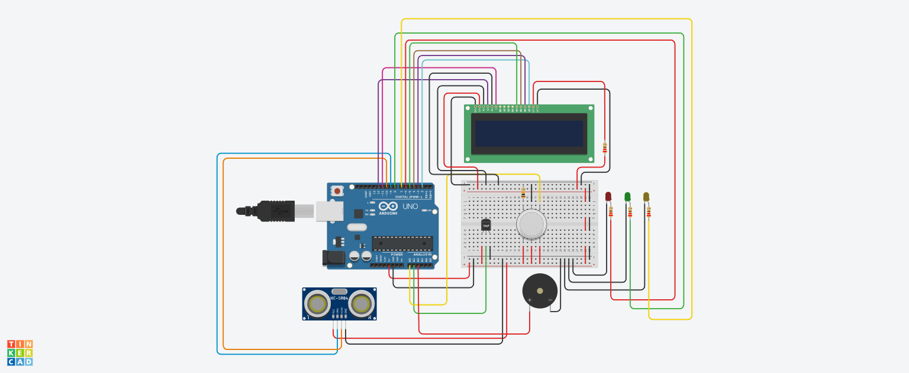

# 🎓 Smart Exam Hall Guard: Anti-Cheating & Safety Monitor (v2.0) 🛡️


**Smart Exam Hall Guard** is an automated invigilation assistant designed to ensure academic integrity and environmental safety. Version 2.0 now features an **Audible Alert System (Buzzer)** along with visual indicators to provide immediate feedback for suspicious activities and environmental hazards.

---

## 💡 Why This Project?
Manual invigilation can be challenging in large halls. This project introduces a **Smart Sensor-Based Monitoring System** that acts as a second pair of eyes for teachers, detecting hidden devices, improper posture, and environmental threats in real-time.

## 🚀 Key Features (Updated)

- **🔍 Intelligent Posture Analysis:** Monitors student distance from the desk (Safe Range: 15cm - 30cm). Alerts if a student leans too close or moves away suspiciously.
- **🔊 Multi-Level Audible Alarms:** A **Piezo Buzzer** triggers different alert patterns for cheating attempts and environmental hazards.
- **🌡️ Stress & Electronic Detection:** Tracks temperature spikes (>38.0°C) to detect high physiological stress or heat from hidden **smartphones/gadgets**.
- **🚭 Advanced Environmental Guard:** Uses a gas sensor (Threshold: 490) to detect smoke, fire, or chemical disturbances.
- **📟 Live Telemetry Dashboard:** A 16x2 LCD displays live Distance (D) and Temperature (T) readings for transparent monitoring.
- **🚨 Triple-LED Status System:**
  - **🟢 GREEN:** All Normal (System Safe).
  - **🔴 RED + BUZZER:** Posture Violation or Smoke Detected.
  - **🟡 YELLOW + BUZZER:** Heat/Electronic Device Alert.

---

## 🧠 The "Smart" Logic v2.0
The system utilizes a refined algorithm to minimize false positives:
1. **Normal State:** If `Distance` is between 15-30cm AND `Temp` < 38°C AND `Smoke` < 490.
2. **Cheating Logic:** 
   - `Distance < 15cm`: Student leaning too close to copy or hide materials.
   - `Distance > 30cm`: Student leaning back to communicate or look at others.
3. **Safety Logic:** `Smoke > 490` indicates immediate environment disturbance.

---

## 🛠️ Hardware Stack

| Component | Pin (Arduino Uno) | Purpose |
| :--- | :--- | :--- |
| **HC-SR04 Ultrasonic** | 9 (Trig), 10 (Echo) | Posture & Proximity Monitoring |
| **TMP36 Sensor** | A1 (Analog) | Body/Device Heat Tracking |
| **MQ Gas Sensor** | A0 (Analog) | Smoke & Disturbance Detection |
| **Piezo Buzzer** | **A2 (Digital Out)** | **Audible Warning System** |
| **16x2 LCD Display** | 12, 11, 5, 4, 3, 2 | Real-time Status Interface |
| **LED Indicators** | 6 (R), 7 (Y), 8 (G) | Visual Status Alerts |

---

## 📸 Circuit Architecture
The circuit was designed and simulated meticulously in **Tinkercad**.



---

## 💻 Quick Start & Installation

1. **Clone the Project:**
   ```bash
   git clone https://github.com/Masum8823/Smart-Exam-Hall-Guard.git
**Setup Hardware:** Connect the sensors and the Buzzer (+) to Pin A2.
**Upload Code:** Open Exam_Hall_Guard.ino in Arduino IDE and upload it to your board.
**Monitor:** Use the LCD or Open the Serial Monitor (9600 baud) for live data plotting.

---

## 🛤️ Future Roadmap

**IoT Connectivity:** Send real-time alerts to the head invigilator's smartphone via Blynk/ESP8266.

**AI Vision:** Integration with camera modules for facial expression analysis.

**Data Logging:** Store all violations in an SD Card with timestamps.

---
## 👨‍💻 Developed by
**MD. Abdulla Al Masum** <br>
Computer Science & Engineering Student  <br>
Passionate about Embedded Systems and IoT Solutions
